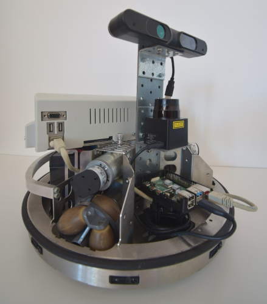

# Changes by Rahul-K-A: Robotino 3 support
For some reason, the way URDF was supported was faulty. So i re-wrote parts of the Robotino URDF file to get it to work. However, **this fork will only work with Robotino 3**, since I removed the URDFs for the older versions.


# Robotino-Core
ROS source code for communicating with the Festo Robotino robot (RTO).



## ROS 1 Packages for Robotino-Core
|master|Melodic + Ubuntu Bionic|Noetic + Ubuntu Focal|
|:---:|:---:|:---:|
|[](https://travis-ci.com/dietriro/rto_core)|[](https://travis-ci.com/dietriro/rto_core)|[](https://travis-ci.com/dietriro/rto_core)|

## Overview

In the following, all packages within this repository are briefly explained.

### Core Repository

<dl>
  <dt><strong><a href="https://github.com/dietriro/rto_core/tree/noetic-devel/rto_bringup">rto_bringup</a></strong></dt>
  <dd> Contains config, script and launch files for starting the robot in the real-world. </dd>
  <dt><strong><a href="https://github.com/dietriro/rto_core/tree/noetic-devel/rto_core">rto_core</a></strong></dt>
  <dd> The meta-package of this repository. </dd>
  <dt><strong><a href="https://github.com/dietriro/rto_core/tree/noetic-devel/rto_description">rto_description</a></strong></dt>
  <dd> Contains all model (visual) data of the robot and its components (sensors). </dd>
  <dt><strong><a href="https://github.com/dietriro/rto_core/tree/noetic-devel/rto_local_move">rto_local_move</a></strong></dt>
  <dd> Contains code for moving the robot locally. </dd>
  <dt><strong><a href="https://github.com/dietriro/rto_core/tree/noetic-devel/rto_local_planner">rto_local_planner</a></strong></dt>
  <dd> Contains a local planner plugin for move-base, specifically designed for the RTO. </dd>
  <dt><strong><a href="https://github.com/dietriro/rto_core/tree/noetic-devel/rto_msgs">rto_msgs</a></strong></dt>
  <dd> Contains special messages needed only for the RTO. </dd>
  <dt><strong><a href="https://github.com/dietriro/rto_core/tree/noetic-devel/rto_navigation">rto_navigation</a></strong></dt>
  <dd> Contains launch and configuration files for starting the robots navigation and mapping. </dd>
  <dt><strong><a href="https://github.com/dietriro/rto_core/tree/noetic-devel/rto_node">rto_node</a></strong></dt>
  <dd> Contains the core source code of the RTO, especially for communication with the rest of the robots hardware. </dd>
  <dt><strong><a href="https://github.com/dietriro/rto_core/tree/noetic-devel/rto_safety">rto_safety</a></strong></dt>
  <dd> Contains a node for collision avoidance, that remaps the velocity in case there is no obstacle in the way. </dd>
  <dt><strong><a href="https://github.com/dietriro/rto_core/tree/noetic-devel/rto_teleop">rto_teleop</a></strong></dt>
  <dd> Contains launch files for teleoperating the RTO using either a keyboard or a joystick. </dd>
</dl>

If you want to operate the robot in a simulated environment (e.g. Gazebo) then please have a look at the related repositories below.

### Related Repositories

<dl>
  <dt><strong><a href="https://github.com/dietriro/rto_simulation">rto_simulation</a></strong></dt>
  <dd> This repository contains everything needed for using the RTO in a simulated environment, like Gazebo. </dd>
</dl>

## Installation

In order to use the robot you first have to install Ubuntu Focal (20.04) as well as ROS Noetic, which currently is the only supported ROS version of this repository. After installing Ubuntu on a computer please follow the instructions below for installing ROS and all other necessary software.

```bash
#!/bin/bash

# Define config variables
ROS_DISTRO=noetic 
ROS_OS=ubuntu:focal
ROS_CI_DESKTOP=`lsb_release -cs`  # e.g. [trusty|xenial|...]

# Install ROS and all necessary dependencies
sudo sh -c "echo \"deb http://packages.ros.org/ros/ubuntu $ROS_CI_DESKTOP main\" > /etc/apt/sources.list.d/ros-latest.list"
sudo apt-key adv --keyserver 'hkp://keyserver.ubuntu.com:80' --recv-key C1CF6E31E6BADE8868B172B4F42ED6FBAB17C654
wget -qO - http://packages.openrobotino.org/keyFile | sudo apt-key add -
sudo sh -c "echo \"deb http://packages2.openrobotino.org focal main\" > /etc/apt/sources.list.d/openrobotino.list"
sudo apt update -qq
sudo apt install -y dpkg rec-rpc robotino-dev robotino-api2 
sudo apt install -y git python3-pip python3-catkin-pkg python3-rosdep ros-$ROS_DISTRO-ros-base

# Install catkin tools using either one of these methods (only one works ususally, try it out in the worst case)
sudo apt install -y python3-catkin-tools
# pip3 install --user git+https://github.com/catkin/catkin_tools.git

# Source the just installed ROS environment and initialize rosdep
source /opt/ros/$ROS_DISTRO/setup.bash
sudo rosdep init
rosdep update

# Create a catkin workspace with the package under integration.
mkdir -p ~/catkin_ws/src
cd ~/catkin_ws/src
catkin_init_workspace

# Create the devel/setup.bash (run catkin_make with an empty workspace) and
# source it to set the path variables.
cd ~/catkin_ws
catkin build
source devel/setup.bash

# Download the code for rto_core
cd ~/catkin_ws/src
git clone https://github.com/dietriro/rto_core.git

# Install dependencies using rosdep
cd ~/catkin_ws
rosdep install -y --from-paths src --ignore-src --rosdistro $ROS_DISTRO --os=$ROS_OS

# Build the workspace
source /opt/ros/$ROS_DISTRO/setup.bash
cd ~/catkin_ws
catkin build
```

After finishing the setup and sucessfully building the workspace, you need to either source the just built workspace everytime you use it or you just add a line to your `.bashrc` so that it is source everytime a new console is opened. I recommend appending the following lines to the end of your `~/.bashrc` file:

```bash
# ROS Setup
source ~/catkin_ws/devel/setup.bash
# In case you want to set a different machine as the ros-master, set the ROS_MASTER_URI as well as ROS_IP to enable communication
export ROS_MASTER_URI='http://host-ip:11311'      
export ROS_IP='your-ip'                             

export ROBOT=rto-1              # Change to whatever robot you would like to use
export ROBOT_ENV=sim-simple     # Change to whatever world you would like to use
```

## Usage

If you want to use a real-world RTO, then you have to first download and install everything as explained in the previous section. Afterwards you can start-up the **communication** with the daemons running on the robot by using the following command:

    roslaunch rto_bringup robot.launch

In order to run this successfully, you first need to specify the robot you'd like to use (e.g. rto-1) as well as the world you would like the robot to use (e.g. sample) as environment variables, if you haven't added them to your `.bashrc` yet.

    export ROBOT=rto-1
    export ROBOT_ENV=sample

The `robot.launch` file then starts up all necessary nodes for communicating with the robot daemons (for driving commands and odometry information), for retrieving sensor information as well as moving the robot around using a joystick (in case it is connected). 

This launch file, however, does not start-up any localization or navigation algorithm. If you would like to map the environment from scratch without a previous map using **SLAM** you can run the following command after starting up the robot as described in the previous part:

    roslaunch rto_navigation slam.launch

You will need the same environment variables (ROBOT, ROBOT_ENV) for this launch file as you did for the previous one. This file then launches a slam algorithm from the [slam-toolbox](https://github.com/SteveMacenski/slam_toolbox). You can of course also use any other slam framework but the one from Steve Macenski is quite comprehensive and covers even long-term features as well as a continuation feature where you start from a previously built map.

If you already have a map and want the robot to **localize and navigate** in it then you need to run the following:

    roslaunch rto_navigation navigation.launch

Again, the same environment variables as before (ROBOT, ROBOT_ENV) are needed. 

Regardless of the localization/navigation launched, you can always run an **rviz** instance with pre-designed configuration file

    roslaunch rto_bringup rviz.launch

This configuration includes visualizations for the most important topics.